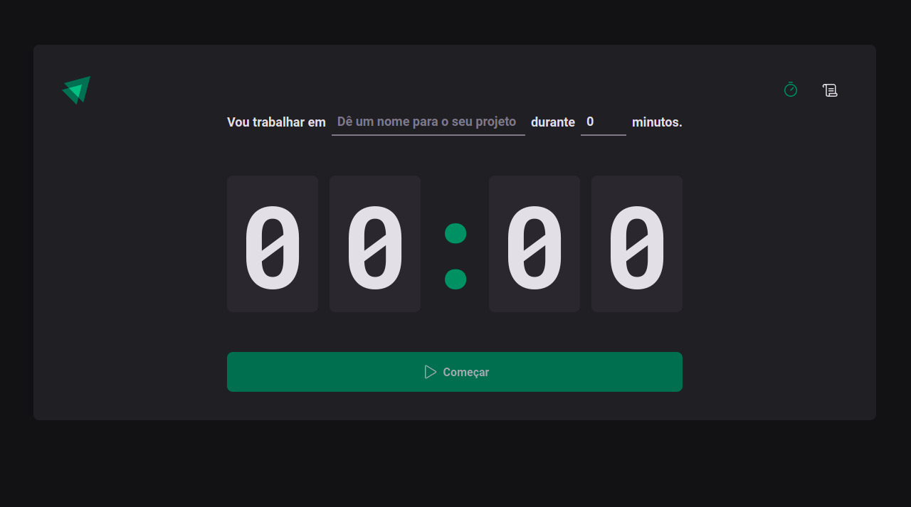

<a id="topo"></a>



<p align="center">
  <a href="https://github.com/RicardoOliveiraFilho">
    
  </a>
  
<p>

<p>
  Projeto de estudos que visa o entendimento dos conceitos do React, como Componente, Estado, Propriedade, Contextos e Hooks. Trata-se de uma aplicação onde
  temos um gerencimento de ciclos de tempo. A aplicação fornece um cadastro onde o usuário informa a tarefa que irá fazer e em quanto tempo ele prentende executá-la.
  Além disso a aplicação lista todos os ciclos já cadastrados, esteja ele concluído, em andamento ou interrompido pelo próprio usuário.
</p>

<p align="center">
  <a href="#features">Features</a> •
  <a href="#pre-requisitos">Pré-requisitos</a> •
  <a href="#rodando">Rodando a Aplicação</a> •
  <a href="#tecnologias">Tecnologias</a> •
  <a href="#autor">Autor</a>
</p>

### Features<a id="features"></a> - <a href="#topo">Topo</a>
- [x] Listar os ciclos de tempo cadastrados!
- [x] Cadastrar um clico de tempo!

<h4  align="left">
Projeto finalizado ✔
</h4>

###  Pré-requisitos<a id="pre-requisitos"></a> - <a href="#topo">Topo</a>

Antes de começar, você vai precisar ter instalado em sua máquina as seguintes ferramentas:
 [Git](https://git-scm.com/),
 [Node.js](https://nodejs.org/pt-br/) 
 e [React](https://reactjs.org/)
 
Além disto é bom ter um editor para trabalhar com o código como [VSCode](https://code.visualstudio.com/) 
 
### Rodando a Aplicação<a id="rodando"></a> - <a href="#topo">Topo</a>
   
````bash 
 # Clone este repositório
 git clone git@github.com:RicardoOliveiraFilho/ignite-timer.git
 # Acesse a pasta do projeto no terminal, a partir do diretório ao qual o comando de clonagem foi executado
 cd ignite-timer
 
 # Instale as dependências
 $ yarn ou
 $ npm i 
 
 # Execute a aplicação em modo de desenvolvimento
 $ npm run dev ou
 $ yarn dev
 
 # O servidor iniciará na porta:3000
 # Acesse http://localhost:3000
 ````

### Tecnologias<a id="tecnologias"></a> - <a href="#topo">Topo</a>
 As seguintes ferramentas foram usadas na construção do projeto:
 
  - [Styled Components](https://styled-components.com/)
  - [Node.js](https://nodejs.org/pt-br/) - Apenas como Ambiente de execução!
  - [ReactJS](https://reactjs.org/)
  - [React Hook Form](https://react-hook-form.com/)

### Autor <a id="autor"> </a> - <a href="#topo">Topo</a>

<a href="https://github.com/RicardoOliveiraFilho" style="text-decoration: none;">

<span> Feito por Ricardo Oliveira - Entre em contato! </span> 
</a>
